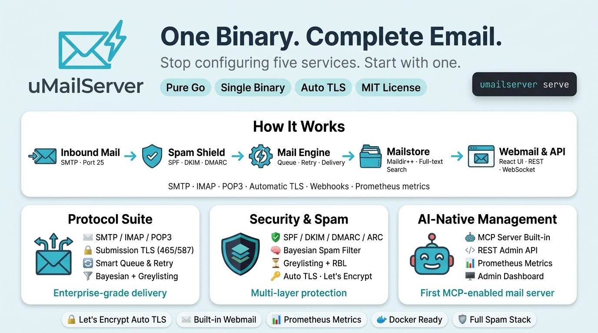

# uMailServer

<p align="center">
  
</p>


  <strong>One binary. Complete email.</strong>


  <a href="https://github.com/umailserver/umailserver/releases">
    
  </a>
  <a href="https://github.com/umailserver/umailserver/actions">
    
  </a>
  <a href="https://goreportcard.com/report/github.com/umailserver/umailserver">
    
  </a>
  <a href="https://codecov.io/gh/umailserver/umailserver">
    
  </a>
  <a href="https://opensource.org/licenses/MIT">
    
  </a>

---

> **Note:** uMailServer v0.1.0 is production ready. Please report any issues found.


**uMailServer** is a modern, self-hosted email server written in Go. It provides everything you need to run a complete email infrastructure: SMTP, IMAP, webmail, admin panel, spam filtering, automatic TLS certificates, and more — all in a single binary.

## Features

- **Single Binary**: Everything embedded, no external dependencies
- **Modern Protocols**: SMTP, IMAP, POP3 with full TLS support
- **Automatic TLS**: Let's Encrypt integration with auto-renewal (ACME v2)
- **Modern TLS**: TLS 1.2 and TLS 1.3 support with configurable minimum version
- **Spam Protection**: SPF, DKIM, DMARC, ARC, RBL, Bayesian filtering, greylisting, heuristic analysis
- **Antivirus**: ClamAV integration for virus scanning
- **Server-side Mail Filtering**: Sieve (RFC 5228) with ManageSieve (RFC 5804)
- **Email Encryption**: S/MIME (RFC 8551) and OpenPGP (RFC 3156) support
- **Delivery Notifications**: DSN (RFC 3461) - Success, Failure, Delay
- **Read Receipts**: MDN (RFC 3798) - Message Disposition Notifications
- **Auto Configuration**: Mozilla Autoconfig & Microsoft Autodiscover
- **Webmail**: Modern React-based web interface with real-time updates
- **Admin Panel**: Manage domains, accounts, queues, certificates
- **MCP Server**: Model Context Protocol for AI assistants
- **Queue Management**: Reliable outbound delivery with retry logic and exponential backoff
- **Full-text Search**: TF-IDF based email search
- **Webhooks**: Event notifications for integrations
- **Rate Limiting**: Per-IP and per-user rate limits for SMTP, IMAP, and HTTP
- **Metrics**: Prometheus-compatible metrics endpoint
- **Authentication**: Native bcrypt password hashing, LDAP/Active Directory support, TOTP 2FA
- **CalDAV/CardDAV**: Calendar and contacts synchronization
- **JMAP**: Modern email API (HTTP-based)
- **Docker**: First-class container support

## Quick Start

### Installation

#### Linux/macOS
```bash
# Download and run installer
curl -fsSL https://raw.githubusercontent.com/uMailServer/uMailServer/main/install.sh | sudo bash

# Or download binary directly from release
wget https://github.com/uMailServer/uMailServer/releases/download/v0.1.0/umailserver-v0.1.0-linux-amd64.tar.gz
tar -xzf umailserver-v0.1.0-linux-amd64.tar.gz

# Quick start (creates config and first account)
sudo umailserver quickstart admin@example.com

# Start server
sudo umailserver serve
```

#### Windows
```powershell
# Run PowerShell as Administrator
irm https://raw.githubusercontent.com/uMailServer/uMailServer/main/install.ps1 | iex

# Or download binary directly from release
# https://github.com/uMailServer/uMailServer/releases/download/v0.1.0/umailserver-windows-amd64.exe
```

#### Docker
```bash
# Pull latest image
docker pull ghcr.io/umailserver/umailserver:latest

# Run
docker run -d \
  --name umailserver \
  -p 25:25 -p 587:587 -p 465:465 \
  -p 143:143 -p 993:993 -p 995:995 \
  -p 4190:4190 -p 443:443 -p 8443:8443 \
  -p 8080:8080 -p 3000:3000 \
  -v umail_data:/var/lib/umailserver \
  ghcr.io/umailserver/umailserver:latest
```

### Port Reference

| Port | Protocol | Description |
|------|----------|-------------|
| 25 | SMTP | Inbound mail (MX) |
| 587 | SMTP | Submission (STARTTLS) |
| 465 | SMTP | Submission (Implicit TLS) |
| 143 | IMAP | IMAP (STARTTLS) |
| 993 | IMAP | IMAP (Implicit TLS) |
| 995 | POP3 | POP3 (Implicit TLS) |
| 4190 | ManageSieve | Sieve script management |
| 443 | HTTPS | Webmail + Admin Panel + REST API |
| 8443 | HTTPS | Admin Panel only (localhost:8443) |
| 8080 | HTTP | Prometheus Metrics |
| 3000 | HTTP | MCP Server (Model Context Protocol) |

## Configuration

Create `/etc/umailserver/umailserver.yaml`:

```yaml
server:
  hostname: mail.example.com
  data_dir: /var/lib/umailserver

tls:
  acme:
    enabled: true
    email: admin@example.com

smtp:
  inbound:
    enabled: true
    port: 25
  submission:
    enabled: true
    port: 587
    require_auth: true
    require_tls: true
  submission_tls:
    enabled: true
    port: 465

imap:
  enabled: true
  port: 993
  starttls_port: 143

http:
  enabled: true
  port: 443

admin:
  enabled: true
  # port: 8443  # Note: Not currently used, admin served on HTTP port
  bind: 127.0.0.1

spam:
  enabled: true
  reject_threshold: 9.0
  junk_threshold: 3.0
  greylisting:
    enabled: true
    delay: 5m

domains:
  - name: example.com
    max_accounts: 100
    max_mailbox_size: 5GB
```

See [umailserver.yaml.example](umailserver.yaml.example) for full configuration options.

## Webmail

Access the webmail at `https://mail.example.com/`

**Keyboard shortcuts:**

| Key | Action |
|-----|--------|
| `c` | Compose |
| `r` | Reply |
| `a` | Reply all |
| `f` | Forward |
| `e` | Archive |
| `#` | Delete |
| `s` | Star |
| `?` | Help |

## Admin Panel

Access the admin panel at `https://localhost:8443/` (localhost only, port 8443)

Features:
- Dashboard with real-time stats
- Domain management with DNS helper
- Account management with TOTP 2FA
- **Alias management** — create, update, delete email aliases
- Queue monitoring with retry/drop
- Rate limiting management
- Security settings (JWT rotation, Argon2id/bcrypt)

## CLI Commands

```bash
# Server commands
umailserver serve                          # Start server
umailserver serve --config /path/to/config.yaml

# Account management
umailserver account add user@example.com
umailserver account delete user@example.com
umailserver account list example.com

# Domain management
umailserver domain add example.com
umailserver domain delete example.com
umailserver domain list

# Queue management
umailserver queue list
umailserver queue retry <id>
umailserver queue flush

# Diagnostics
umailserver check dns example.com
umailserver check tls example.com
umailserver check deliverability example.com

# Testing
umailserver test send from@example.com to@example.com "Test Subject"

# Backup & restore
umailserver backup /backups/
umailserver restore /backups/backup-2024-01-01.tar.gz

# Migration
umailserver migrate --type imap --source imaps://old-server.com --username user@old.com --target user@new.com
umailserver migrate --type dovecot --source /var/mail --passwd-file /etc/dovecot/users
umailserver migrate --type mbox --source /path/to/mail/*.mbox

# Get version
umailserver version
```

## Architecture

```
┌─────────────────────────────────────────────────────────────┐
│                        uMailServer                           │
├─────────────────────────────────────────────────────────────┤
│  SMTP (25, 587, 465)  │  IMAP (143, 993)  │  HTTP (443)      │
├───────────────────────┼───────────────────┼──────────────────┤
│  Message Pipeline     │  Mailstore        │  REST API        │
│  - SPF/DKIM/DMARC     │  - Maildir++      │  - Auth (JWT)    │
│  - ARC Validation     │  - bbolt          │  - WebSocket     │
│  - Greylisting        │  - Search Index   │  - MCP           │
│  - RBL Checks         │                   │                  │
│  - Bayesian Filter    │                   │                  │
│  - Sieve Rules        │                   │                  │
│  - AV Scan            │                   │                  │
├───────────────────────┴───────────────────┴──────────────────┤
│         Web UI (React + Vite) - Admin, Account, Webmail      │
│              (embedded via embed.FS)                         │
└─────────────────────────────────────────────────────────────┘
```

## Development

```bash
# Clone repository
git clone https://github.com/umailserver/umailserver.git
cd umailserver

# Setup development environment
make setup

# Run in development mode (hot reload)
make dev

# Run tests
make test

# Build for all platforms
make build-all

# Build Docker image
make docker
```

## Requirements

- Linux, macOS, or Windows
- Go 1.25+ (for building from source)
- Node.js 20+ (for UI development)
- Docker (optional)

## Default Paths

| Path | Linux/macOS | Windows |
|------|-------------|---------|
| **Config** | `/etc/umailserver/umailserver.yaml` | `C:\Program Files\umailserver\umailserver.yaml` |
| **Data** | `/var/lib/umailserver` | `C:\ProgramData\umailserver` |
| **Logs** | `/var/log/umailserver` | `C:\ProgramData\umailserver\logs` |
| **Admin API** | `127.0.0.1:8443` | `127.0.0.1:8443` |

## Documentation

Local documentation in `docs/`:
- [Architecture](docs/ARCHITECTURE.md) - System design and component architecture
- [Configuration Reference](docs/configuration.md) - Complete configuration reference
- [API Specification](docs/API_SPECIFICATION.md) - OpenAPI 3.0.3 specification
- [Distributed Tracing](docs/DISTRIBUTED_TRACING.md) - OpenTelemetry tracing setup
- [Performance Tuning](docs/PERFORMANCE_TUNING.md) - Production optimization guide
- [DNS Setup Guide](docs/dns-setup.md) - DNS configuration guide
- [Deployment Guide](docs/DEPLOYMENT.md) - Production deployment guide
- [Security Hardening](docs/SECURITY_HARDENING.md) - Security best practices
- [Troubleshooting Guide](docs/troubleshooting.md) - Common issues and solutions
- [Migration Guide](docs/migration.md) - Migrating from other servers
- [Quick Start](docs/quickstart.md) - Getting started quickly
- [API Reference](docs/api-reference.md) - API documentation

Online documentation at [docs.umailserver.com](https://docs.umailserver.com)

## Contributing

We welcome contributions! Please see [docs/CONTRIBUTING.md](docs/CONTRIBUTING.md) for guidelines.

## License

MIT License - see [LICENSE](LICENSE) for details.

---

<p align="center">
  Made with ❤️ by the uMailServer team
</p>
